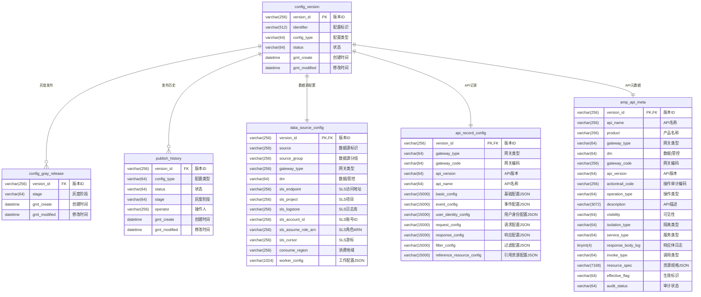

# 配置管理服务

一个用于管理和发布配置的服务系统，支持灰度发布和版本控制。

## 功能特性

- 支持多种配置类型（数据源配置、API元数据、API记录）
- 基于阶段的灰度发布策略
- 版本控制和回滚机制
- 发布历史记录
- 配置变更检测

## 系统架构

### 数据模型



### 灰度发布策略

采用基于阶段(Stage)的灰度发布策略：
- STAGE_1: 首批灰度地域
- STAGE_2: 第二批灰度地域
- FULL: 全量发布

### 配置状态流转

- DRAFT: 草稿状态
- PUBLISHED: 已发布状态
- DEPRECATED: 已废弃状态

## API接口

### 数据源配置接口

```http
POST   /api/datasource              # 创建配置
PUT    /api/datasource/{versionId}  # 更新配置
GET    /api/datasource/{versionId}  # 获取指定版本
GET    /api/datasource/published    # 获取所有已发布配置
GET    /api/datasource/active       # 获取指定地域生效的配置
POST   /api/datasource/diff         # 获取配置变更信息
```

### 发布管理接口

```http
POST   /api/publish/{versionId}              # 发布配置
POST   /api/publish/{versionId}/deprecate    # 废弃配置
POST   /api/publish/rollback/previous        # 回滚到上一版本
POST   /api/publish/rollback/{targetVersionId}# 回滚到指定版本
GET    /api/publish/history/{versionId}      # 获取发布历史
GET    /api/publish/stages                   # 获取灰度阶段信息
```

## 配置示例

### 数据源配置

```json
{
  "source": "example-source",
  "sourceGroup": "example-group",
  "gatewayType": "API",
  "dm": "DATA",
  "slsEndpoint": "cn-hangzhou.log.aliyuncs.com",
  "slsProject": "example-project",
  "slsLogstore": "example-logstore",
  "workerConfig": "{\"fetchIntervalMillis\": 1000}"
}
```

## 部署要求

- Java 8
- MySQL 5.7+
- Spring Boot 2.7+

## 配置说明

```yaml
spring:
  datasource:
    url: jdbc:mysql://localhost:3306/config_management
    username: root
    password: password

config:
  version:
    max-datasource-versions: 5
    max-apirecord-versions: 5
    max-api-meta-versions: 5

diff:
  ignore-fields: gmt_create,gmt_modified
```

## 开发指南

1. 克隆项目
2. 配置数据库连接
3. 执行 schema.sql 创建数据库表
4. 运行应用

```bash
./mvnw spring-boot:run
```

## API文档

访问 Swagger UI：
```
http://localhost:8080/swagger-ui.html
```

## 注意事项

- 配置发布前需要先创建版本
- 灰度发布需要指定正确的阶段
- 回滚操作会创建新的版本
