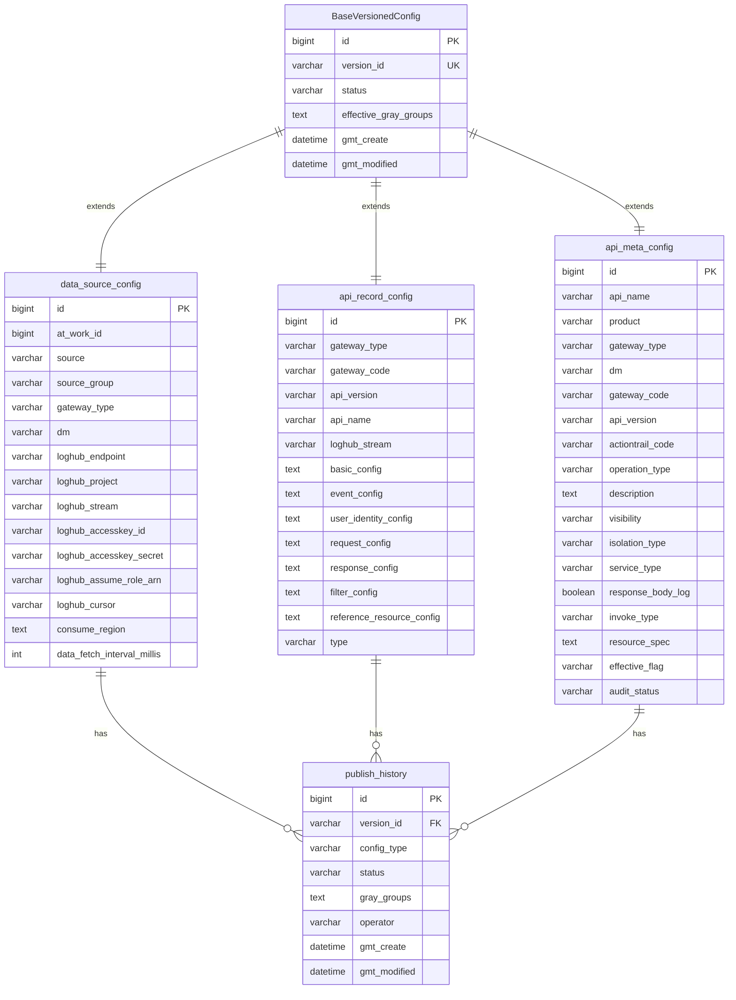
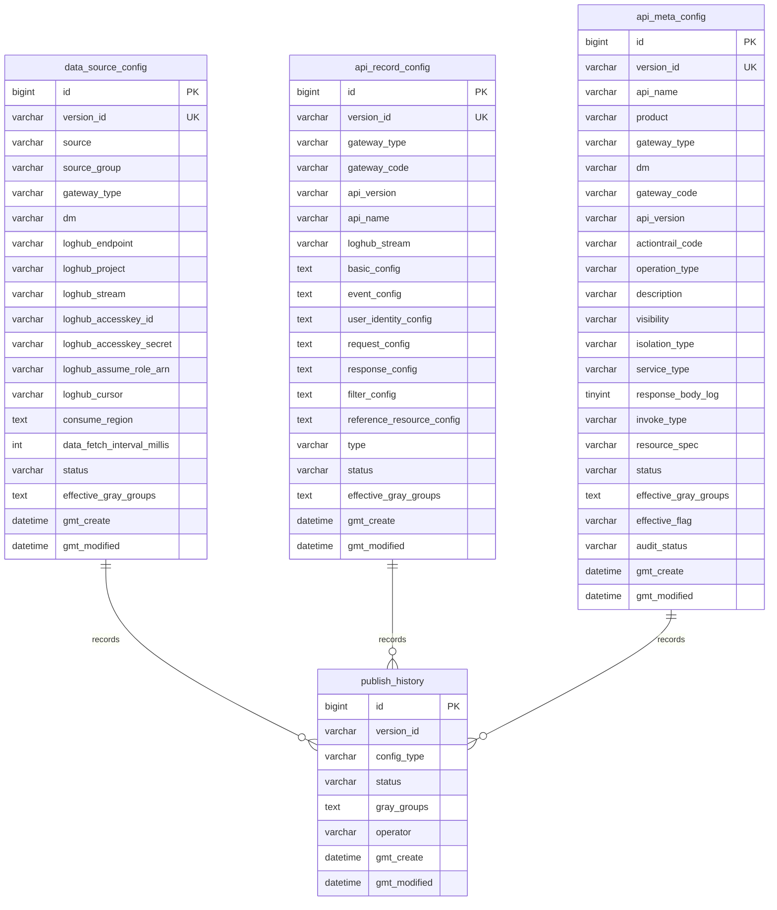
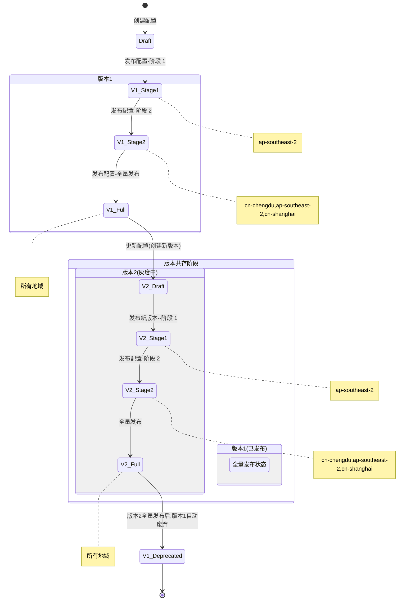
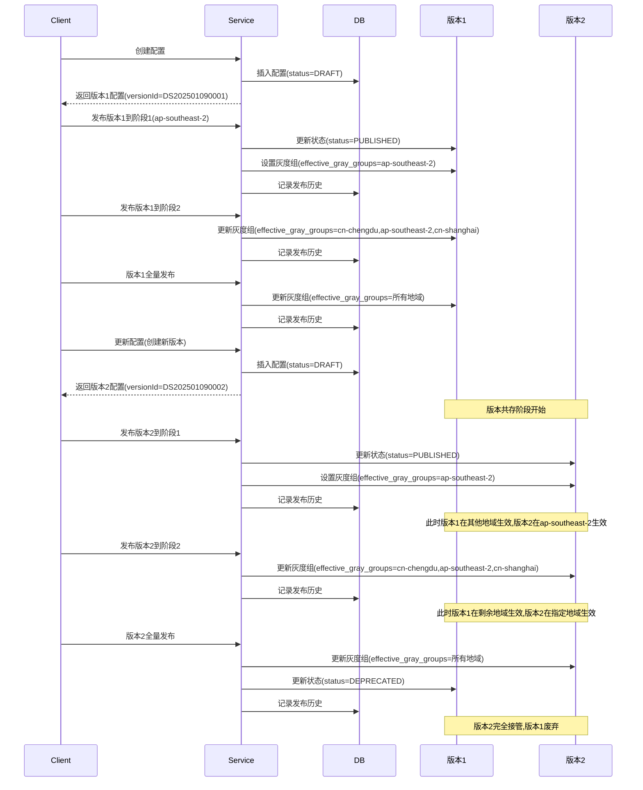

# 数据模型


ER 关系图









### 发布接口

#### 发布配置

```
POST /api/publish
```

#### 按照阶段发布配置

```
POST /api/publish/stage
```

#### 回滚配置

```
POST /api/publish/rollback
```

#### 废弃配置

```
POST /api/publish/deprecate
```

#### 回滚到上一个版本

```
POST /api/publish/rollback/previous
```

#### 获取发布历史

```
GET /api/publish/history
```

#### 获取所有灰度阶段配置

```
GET /api/publish/stage
```

### 数据源配置接口

#### 创建数据源配置

```
POST /api/config/create
```

#### 更新数据源配置

```
POST /api/config/update
```

#### 获取当前地域生效的所有数据源配置

```
GET /api/config/active
```

#### 获取指定source的所有已发布数据源配置

```
GET /api/config/published
```

#### 获取指定source在指定地域生效的数据源配置

```
GET /api/config/active
```
