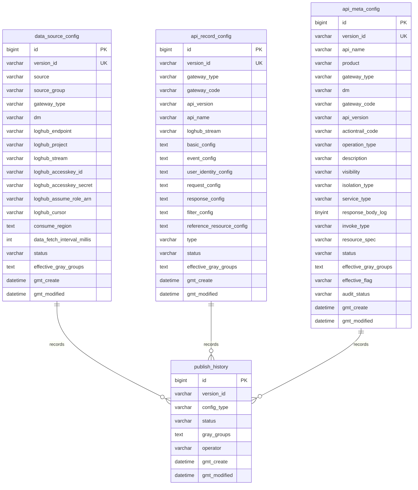
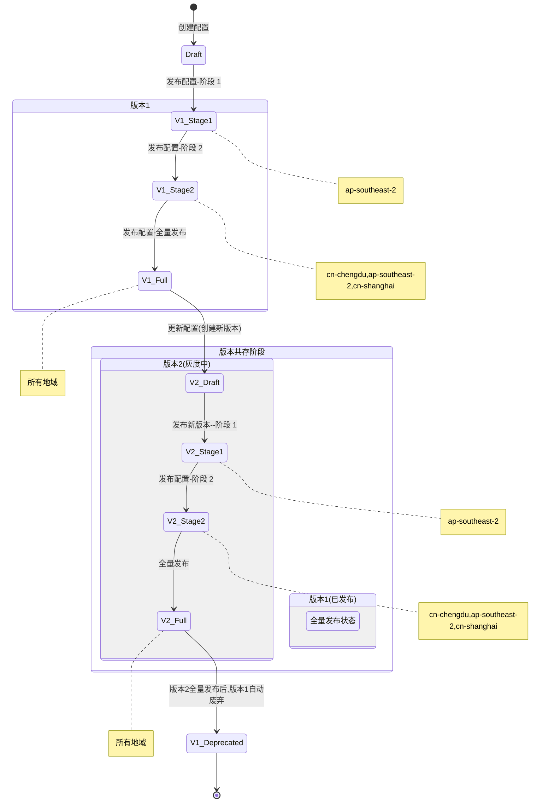

# 数据模型

```mermaid
erDiagram
    data_source_config {
        bigint id PK
        varchar version_id UK
        varchar source
        varchar source_group
        varchar gateway_type
        varchar dm
        varchar loghub_endpoint
        varchar loghub_project
        varchar loghub_stream
        varchar loghub_accesskey_id
        varchar loghub_accesskey_secret
        varchar loghub_assume_role_arn
        varchar loghub_cursor
        text consume_region
        int data_fetch_interval_millis
        varchar status
        text effective_gray_groups
        datetime gmt_create
        datetime gmt_modified
    }

    api_record_config {
        bigint id PK
        varchar version_id UK
        varchar gateway_type
        varchar gateway_code
        varchar api_version
        varchar api_name
        varchar loghub_stream
        text basic_config
        text event_config
        text user_identity_config
        text request_config
        text response_config
        text filter_config
        text reference_resource_config
        varchar type
        varchar status
        text effective_gray_groups
        datetime gmt_create
        datetime gmt_modified
    }

    api_meta_config {
        bigint id PK
        varchar version_id UK
        varchar api_name
        varchar product
        varchar gateway_type
        varchar dm
        varchar gateway_code
        varchar api_version
        varchar actiontrail_code
        varchar operation_type
        varchar description
        varchar visibility
        varchar isolation_type
        varchar service_type
        tinyint response_body_log
        varchar invoke_type
        varchar resource_spec
        varchar status
        text effective_gray_groups
        varchar effective_flag
        varchar audit_status
        datetime gmt_create
        datetime gmt_modified
    }

    publish_history {
        bigint id PK
        varchar version_id
        varchar config_type
        varchar status
        text gray_groups
        varchar operator
        datetime gmt_create
        datetime gmt_modified
    }

    data_source_config ||--o{ publish_history : "records"
    api_record_config ||--o{ publish_history : "records"
    api_meta_config ||--o{ publish_history : "records"
```

```mermaid
stateDiagram-v2
    [*] --> Draft: 创建配置
    Draft --> V1_Stage1: 发布配置-阶段 1
    
    state "版本1" as V1 {
        V1_Stage1 --> V1_Stage2: 发布配置-阶段 2
        V1_Stage2 --> V1_Full: 发布配置-全量发布
        note right of V1_Stage1: ap-southeast-2
        note right of V1_Stage2: cn-chengdu,ap-southeast-2,cn-shanghai
        note right of V1_Full: 所有地域
    }
    
    V1_Full --> V2_Draft: 更新配置(创建新版本)
    
    state "版本共存阶段" as Coexist {
        state "版本1(已发布)" as V1_Active {
            V1_Published: 全量发布状态
        }
        
        state "版本2(灰度中)" as V2_Active {
            V2_Draft --> V2_Stage1: 发布新版本--阶段 1
            V2_Stage1 --> V2_Stage2: 发布配置-阶段 2
            V2_Stage2 --> V2_Full: 全量发布
            note right of V2_Stage1: ap-southeast-2
            note right of V2_Stage2: cn-chengdu,ap-southeast-2,cn-shanghai
            note right of V2_Full: 所有地域
        }
    }
    
    V2_Full --> V1_Deprecated: 版本2全量发布后,版本1自动废弃
    V1_Deprecated --> [*]

```
